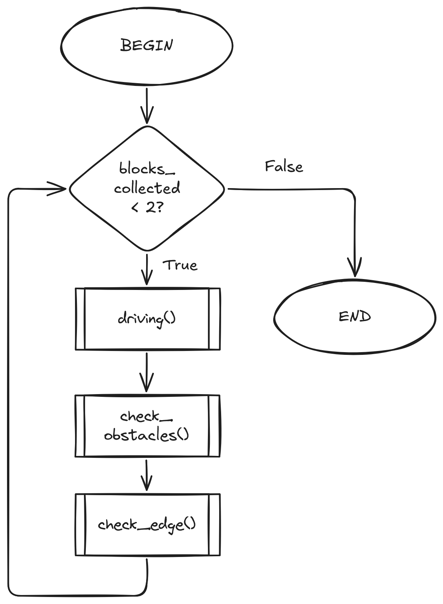

# 9CT Task 1 - Mechatronics
### By Fraser Maple

## Requirements outline

### Purpose

I need to design a program for the EV3 MINDSTORM robot that will allow it to collect red and yellow LEGO blocks and bring them to a designated area, while avoiding all other LEGO blocks. I must use at least two sensors in my design for navigation and object detection.

### Key actions

- Use colour sensor to detect edges of the map to ensure it does not leave.
- Use ultrasonic sensor to detect obstacles.
- Avoid obstacles if they aren't the correct colour.
- Move the correct blocks to the designated area.

### Functional requirements
- Edge of map detection - The colour sensor points down to detect the edge of the map. When the edge of the map is detected, the robot will stop moving, rotate, and begin moving again.
- Obstacle detection - The ultrasonic sensor is used to detect when an obstacle is within 5 cm of the robot. When an obstacle is nearby, a motor will rotate the colour sensor to determite the colour of the block.
- Obstacle evasion - If the colour of the block is bad, the robot will rotate and then continue to move forward.
- Block transportation - If the colour of the block is good, it will be collected and taken to the designated area.

### Use cases

1. Edge of map detection
- Scenario: The robot is moving forward and the robot reaches the edge of the map.
- Inputs: The colour sensor detects the black border of the map.
- Action: The robot stops and turns, before moving again.
- Expected outcome: The robot avoids the edge of the map and continues moving forward.

2. Obstacle detection
- Scenario: The robot is moving forward and encounters an obstacle.
- Inputs: The ultrasonic sensor detects an object within 5 cm.
- Action: The robot stops and rotates the colour sensor to detect the colour of the block.
- Expected outcome: The robot detects the colour of the block.

3. Obstacle evasion
- Scenario: The block is not supposed to be collected.
- Inputs: The colour sensor detects an the colour of the object.
- Action: The robot stops and turns, before moving again.
- Expected outcome: The robot avoids the block and continues moving.

4. Block transportation
- Scenario: The block is supposed to be collected.
- Inputs: The colour sensor detects an the colour of the object.
- Action: The robot uses a spear to collect the block and bring it back to the starting area.
- Expected outcome: The block is in its designated area.

### Test cases
|Test Case|Input|Expected output|
|-|-|-
|Avoids leaving map|Colour sensor detects black line|Robot stops, turns and continues moving|
|Detects obstacle|Ultrasonic sensor detects <5 cm|Robot rotates colour sensor and detects colour of the block.|
|Avoids obstacle|Colour sensor detects block is green/blue|Robot stops, turns and continues moving|
|Transports block|Colour sensor detects block is red/yellow|Robot collects block and moves it to the starting area.|

### Non-functional requirements

- Efficiency - The robot should be efficient and not waste time doing pointless things.
- Response Time - The robot should be quick to react input from sensors.
- Accuracy - The robot should be accurate in it's detection and measurements using the sensors.

## Design

### Mainline routine
```
BEGIN
    WHILE blocks_collected < 2
        driving()
        check_obstacles()
        check_edge()
    ENDWHILE
END
```


### check_obstacles()
```
BEGIN
    READ distance
    IF distance <= 50
        Rotate colour sensor 90 degrees
        READ colour
        IF colour == red or yellow
            collect_block()
        ELSE
            Backwards 50 mm
            Turn 90 degrees
        ENDIF
    ENDIF
END
```
.png)

### check_edge()
```
BEGIN
    READ reflection
    IF reflection >= 50
        Backwards 50 mm
        Turn 90 degrees
    ENDIF
END
```
.png)

## Development and Integration
This code was my first prototype that I created using the use cases and algorithms previously defined. It does not have any means of collecting blocks, as I would add that later on.
```Python
#!/usr/bin/env pybricks-micropython
from pybricks.hubs import EV3Brick
from pybricks.ev3devices import (Motor, TouchSensor, ColorSensor,
                                 InfraredSensor, UltrasonicSensor, GyroSensor)
from pybricks.parameters import Port, Stop, Direction, Button, Color
from pybricks.tools import wait, StopWatch, DataLog
from pybricks.robotics import DriveBase
from pybricks.media.ev3dev import SoundFile, ImageFile

# Variables
ev3 = EV3Brick()
left_motor = Motor(Port.B)
right_motor = Motor(Port.C)
robot = DriveBase(left_motor, right_motor, wheel_diameter=55.5, axle_track=104)
colour_sensor = ColorSensor(Port.S3)
ultrasonic_sensor = UltrasonicSensor(Port.S2)
colour_sensor_motor = Motor(Port.A)
blocks_collected = 0

# Functions
def collect_block():
    ev3.speaker.beep()
    robot.straight(-50)
    robot.turn(90)

def driving():
    while colour_sensor.reflection() > 50 and ultrasonic_sensor.distance() > 50: # Robot drives until it detects the edge of the map or an obstacle.
        robot.drive()

def check_obstacles():
    if ultrasonic_sensor.distance() <= 50: # Checks if there's an obstacle.
        colour_sensor_motor.run_angle(-90)
        if colour_sensor.Color() == Color.RED or Color.YELLOW: # Checks the colour of the obstacle, and collects the obstacle if it is yellow or red, avoiding it if it is not.
            ev3.screen.print("Block found!")
            collect_block()
        else:
            ev3.screen.print("Wrong colour!")
            robot.straight(-50)
            robot.turn(90)

def check_edge():
    if colour_sensor.reflection() <= 50: # Checks if the robot has reached the edge of the map, and then reverses and turns to avoid leaving the map.
        robot.straight(-50)
        robot.turn(90)  

# Main loop
while blocks_collected < 2:
    driving()
    check_obstacles()
    check_edge()
```
## Testing and Debugging
### Edge of map detection
|Test Case|Input|Expected output|
|-|-|-|
|Avoids leaving map|Colour sensor detects black line|Robot stops, turns and continues moving|

This test case requires the colour sensor to detect a line and for the robot to avoid crossing it. This code is very simple and did not require modifications from its protoype. It could possible be improved by choosing a different threshold of reflection to ensure the edge of the map isn't falsely detected.

```Python
if colour_sensor.reflection() <= 50:
        robot.straight(-50)
        robot.turn(90)  
```
###  Obstacle detection
|Test Case|Input|Expected output|
|-|-|-
|Detects obstacle|Ultrasonic sensor detects <5 cm|Robot rotates colour sensor and detects colour of the block.|

In this test case, the robot should detect the presence of an obstacle in front of it, and then rotate the colour sensor to determine the colour of the block and react accordingly. It worked well and incorporates a clever design allowing the colour sensor to both detect the edge of the map and block's colour.

```Python
if ultrasonic_sensor.distance() <= 50:
        colour_sensor_motor.run_angle(-90)
        if colour_sensor.Color() == Color.RED or Color.YELLOW:
            ev3.screen.print("Block found!")
            ev3.speaker.beep()
        else:
            ev3.screen.print("Wrong colour!")
            robot.straight(-50)
            robot.turn(90)
```
### Obstacle evasion
|Test Case|Input|Expected output|
|-|-|-
|Avoids obstacle|Colour sensor detects block is green/blue|Robot stops, turns and continues moving|

This was a very simple test case that was incorporated into the previous one. The robot should recognise that the block is not yellow or red, and navigate around it. It utilises the same code for evasion as the edge of map detection.
### Block transportation
|Test Case|Input|Expected output|
|-|-|-
|Transports block|Colour sensor detects block is red/yellow|Robot collects block and moves it to the starting area.|

This test case was not implemented in my original prototype due it being the most difficult to do, and in the end I didn't create this test case at all, due to a lack of time. The robot should collect the block if it is the right colour, and return it to the starting area.

## Evaluation
### Charles
**How much effort do you feel this group member put into this project?**

5/5

Charles was focused on his work most of the time, and contributed greatly to the research, designing, and development of this project, creating a full solution to the problem at hand.

**How much did this team member contribute to the team's efforts throughout this project?**

4/5

Much of Charles' code was used in the code that the group used for the final test, although lots of Charles' code was sourced from other group members.

**How effective was this team member's final test case?**

3/5

None of our code was tested particularly thouroughly due to technical issues we faced with our robot, but from what I saw of Charles' code, it seemed fairly functional.

**How well do you think this team member performed throughout all stages of the project?**

4/5

Charles did very well throughout the project, from the research to the final testing, he played a major role,

### Oscar

**How much effort do you feel this group member put into this project?**

3/5

Oscar was a little bit distracted at the start of the research task, but pulled through, completing it well, and put a lot of effort into his code. 

**How much did this team member contribute to the team's efforts throughout this project?**

4/5

Some of his solutions were vital to our final code, and he did major parts of the research and designing.

**How effective was this team member's final test case?**

5/5

Oscar's code seemed to be the most functional of the groups, with it being clear he'd spent a lot of time working on it.

**How well do you think this team member performed throughout all stages of the project?**

4/5

Overall, Oscar performed very well in this project, and produced an excellent solution to the problem.

### Final evaluation questions
**Evaluate your individual Final Test in Relation to Functional Criteria**

Due to poor time management, I didn't get to test my code much at all. The little time I did get to test I experienced an issue where the robot wouldn't do anything. I couldn't determine whether it was a problem with my code or with the robot, as when I tried running other code from the GitBook, it only sometimes worked.

I believe my code should habe completed the functional criteria, besides the block collection which I did not complete. But due to the small number of tests it was very hard to tell.

**Evaluate your individual Final Test in Relation to Non-Functional Criteria**

Again, due to the inability to test, I am unsure of how well my code met the non-functional criteria. I don't believe it would have been particularly efficient, fast, or accurate, as I was not able to test in order to optimise certain aspects such as obstacle evasion or colour detection.

**Evaluate your group's Final Performance in Relation to the Identified Need**

The final test was not great as the code did not work at all. With more time we could have perfected it in order to ensure it could run smoothly with no bugs.

**Evaluate your Project in Relation to Project Management**

Our lack of time was our own fault, as we poorly managed our time, spending far too long on the research task and designing. If I'd done more work in the holidays on the theory parts, I would've had much more time to test.

**Evaluate your Project in Relation to Team Collaboration**

Our team collaborated well, with discussions about how to solve certain problems. Our final code in particular was a product of team collaboration, utilising bits of code from every team member.

**Justify Future Improvements you could make to your Final Product**

I could spend more time testing my code to ensure it runs smoothly and consistently with no bugs, and accomplishes it's goal. I could have also more properly optimised it to ensure speed and efficiency. I could also implement an improvement to the hardware in the form of a proper block collection system such as a grabber or spear.